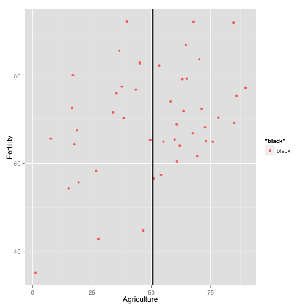
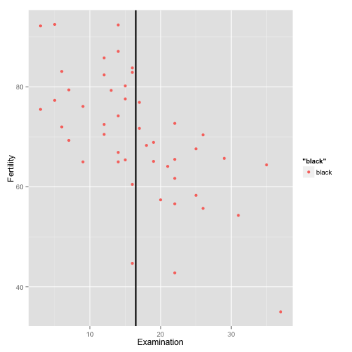
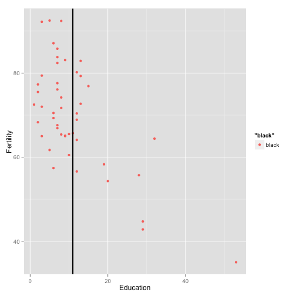

Developing Data projects
========================================================
author: Hans-Joachim Kirlum
date: May 24, 2015
width: 1440
height: 900

Swiss Data
========================================================
transition: rotate

Standardized fertility measure and socio-economic indicators for each of 47 French-speaking provinces of Switzerland at about 1888.

```
   Fertility      Agriculture     Examination      Education    
 Min.   :35.00   Min.   : 1.20   Min.   : 3.00   Min.   : 1.00  
 1st Qu.:64.70   1st Qu.:35.90   1st Qu.:12.00   1st Qu.: 6.00  
 Median :70.40   Median :54.10   Median :16.00   Median : 8.00  
 Mean   :70.14   Mean   :50.66   Mean   :16.49   Mean   :10.98  
 3rd Qu.:78.45   3rd Qu.:67.65   3rd Qu.:22.00   3rd Qu.:12.00  
 Max.   :92.50   Max.   :89.70   Max.   :37.00   Max.   :53.00  
    Catholic       Infant.Mortality
 Min.   :  2.150   Min.   :10.80   
 1st Qu.:  5.195   1st Qu.:18.15   
 Median : 15.140   Median :20.00   
 Mean   : 41.144   Mean   :19.94   
 3rd Qu.: 93.125   3rd Qu.:21.70   
 Max.   :100.000   Max.   :26.60   
```


Plot1
========================================================
transition: zoom

The Plot shows the fertility measures in dependency on the percentage of males involved in agriculture as occupation.

 

Plot 2
========================================================
transition: fade

The Plot shows the fertility measures in dependency on the percentage of draftees receiving highest mark on army examination.

 


Plot 3
========================================================
transition: linear

The Plot shows the fertility measures in dependency on the percentage of education beyond primary school for draftees.

 
